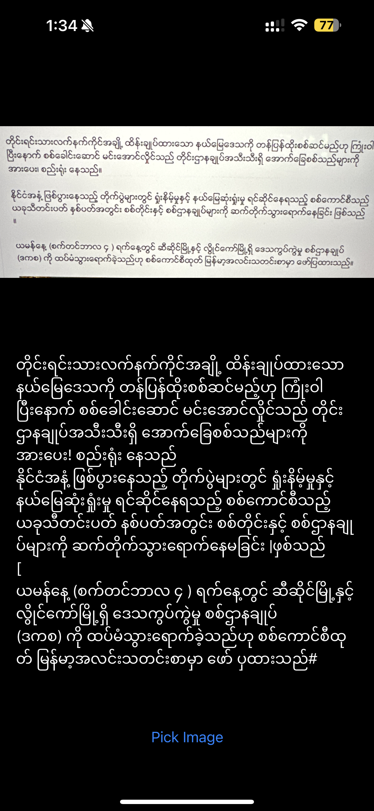

## MyanmarOCR for iOS App
> A lazy people do a simple thing. This is a simple Myanmar OCR with Tesseract-OCR for iOS App.

## Dependencies
- SwiftyTesseract (Tesseract-OCR)
- SwiftUI
- TOCropViewController (for image crop)

## Demo
   Screen 1 | 
:-------------------------: | 
 | 
